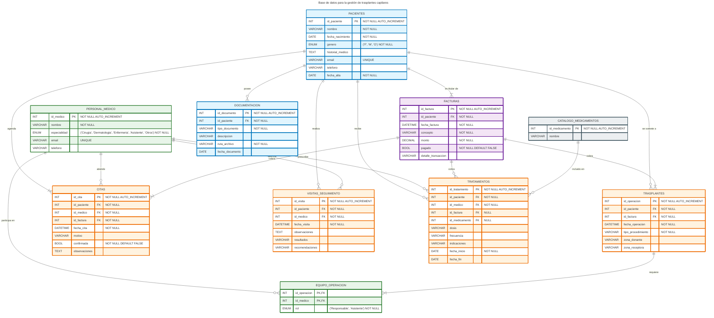
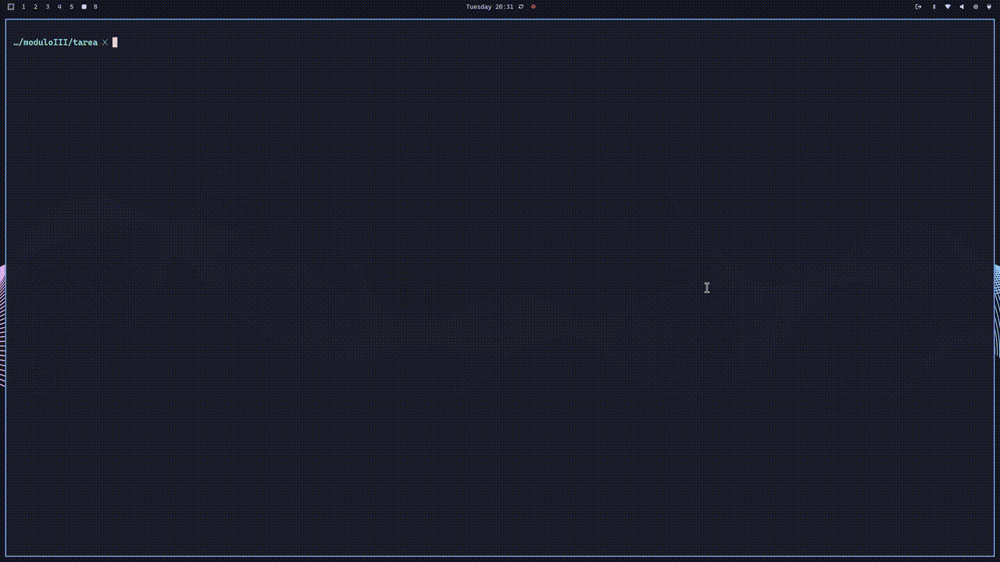
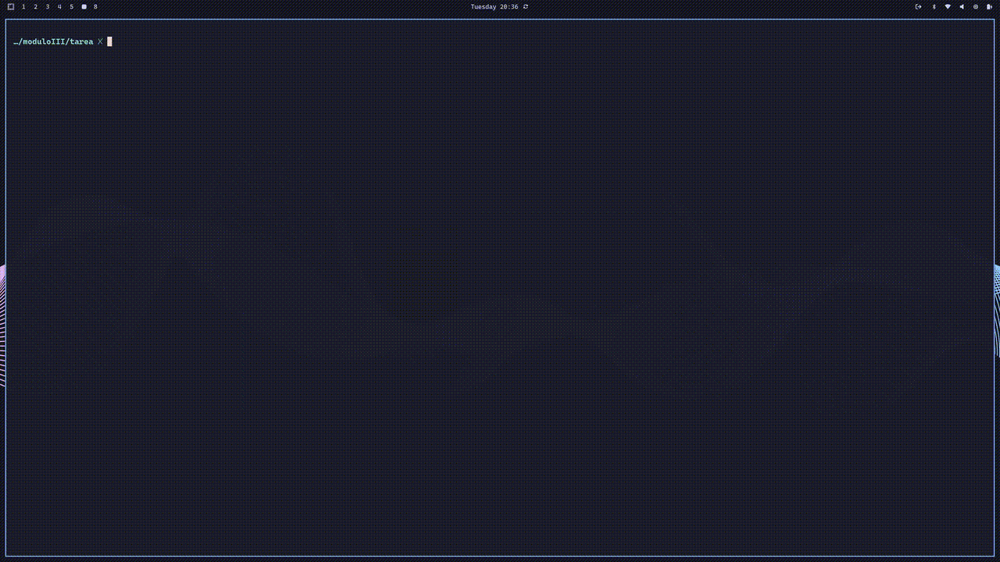

# Modelado de datos

Tarea del **Máster Big Data & Data Engineering 2025-2026**, para la asignatura de modelo de datos.

## Parte 1: Diseño de base de datos para clínica capilar

Diseñar una base de datos que permita gestionar una empresa dedicada a los trasplantes capilares.

### Consideraciones iniciales

El diseño de la base de datos se va a realizar teniendo en cuenta, las tablas y atributos propuestos como parte del enunciado del ejercicio y las siguientes consideraciones:

- Para ser registrado como **paciente**, es indispensable tener al menos una cita agendada, lo cual implica la generación de al menos una factura.
- Los **trasplantes** son supervisados por un **equipo médico** que puede estar compuesto por varios miembros (roles definidos).
- Las **citas** y las **visitas de seguimiento** son atendidas por un único miembro del **equipo médico**.
- Cada **tratamiento** es único y específico de un cliente.
- Los **tratamientos** no requieren la obligatoriedad de administrar un medicamento. Los **medicamentos** recetados en los tratamientos se normalizan en una tabla independiente `CATALOGO_MEDICAMENTOS`.
- Las **visitas de seguimiento** y los **tratamientos** se almacenan como hechos clínicos independientes para mayor flexibilidad.

### Diagrama Entity Relationship

### Decisiones de diseño y tipos de datos

Detalle de los tipos escogidos para los atributos de la base de datos:

- Tipos numéricos:
  * **INT:** Usados con *auto-increment y NOT NULL* como claves primarias de las tablas. Ver: [documentación.](https://dev.mysql.com/doc/refman/8.4/en/primary-key-optimization.html)
  * [**DECIMAL:**](https://dev.mysql.com/doc/refman/8.4/en/fixed-point-types.html) Para obtener precisión numérica al trabajar con *facturas*.
  * [**BOOL:**](https://dev.mysql.com/doc/refman/8.4/en/numeric-type-syntax.html) Cuando solo requerimos almacenar `TRUE`o `FALSE`, en el caso de la *confirmación de citas y el pago de facturas.*
- Tipos fecha:
  * **DATE:** Cuando no necesitamos precisión de `hh:mm:ss`.
  * **DATETIME:** Cuando requerimos `hh:mm:ss` en el caso de *trasplantes, citas, visitas y facturas*. Se usa sin fracciones de segundo, [comportamiento por defecto.](https://dev.mysql.com/doc/refman/8.4/en/date-and-time-type-syntax.html).
- Tipos cadena de texto:
  * **VARCHAR:** Para campos de tamaño mediano.
  * [**TEXT:**](https://dev.mysql.com/doc/refman/8.4/en/blob.html) En el caso de las *observaciones de citas y visitas de seguimiento e historial médico* requerimos mayor flexibilidad.
  * [**ENUM:**](https://dev.mysql.com/doc/refman/8.4/en/enum.html) Para los casos donde la lista de valores es predefinida, optimizan el almacenamiento guardando las opciones como números.

- Para las **foreing keys** usaremos **RESTRICT** para los casos más restrictivos, p.ej. no podemos borrar un paciente si tiene facturas, trasplantes o tratamiento por ejemplo.

El código completo del ejercicio resuelto se encuentra en [**sql1.sql**](sql1.sql).

## Parte 2: Implementación y consultas sobre modelo relacional dado

Desarrollo de una base de datos a partir de un modelo relacional dado.

El ćodigo completo del ejercicio resuelto se encuentra en [**sql2.sql**](sql2.sql).

## Ejecución de scripts y pruebas

Las soluciones a los ejercicios: [**sql1.sql**](sql1.sql), [**sql2.sql**](sql2.sql), están preparadas para que puedan ser ejecutadas como scripts desde la consola de **mysql**.

---
[@title]: #
[Source - https://stackoverflow.com/a/35760941]: #
[Posted by Harmon, modified by community. See post 'Timeline' for change history]: #
[Retrieved 2026-02-26, License - CC BY-SA 4.0]: #

<footer style="width:100%; display:flex; justify-content:center; margin:3rem 0;">
    

      <a href="https://alejandrodecora.es/til" style="width:100%; display:flex; justify-content:center; text-decoration: none;">
          Hecho con 💜 por
          <!-- prettier-ignore -->
          <svg viewBox="0 0 600 530" version="1.1" xmlns="http://www.w3.org/2000/svg" style="position: relative; top: 4px; height: 1.25em;">
          <path
            d="m135.72 44.03c66.496 49.921 138.02 151.14 164.28 205.46 26.262-54.316 97.782-155.54 164.28-205.46 47.98-36.021 125.72-63.892 125.72 24.795 0 17.712-10.155 148.79-16.111 170.07-20.703 73.984-96.144 92.854-163.25 81.433 117.3 19.964 147.14 86.092 82.697 152.22-122.39 125.59-175.91-31.511-189.63-71.766-2.514-7.3797-3.6904-10.832-3.7077-7.8964-0.0174-2.9357-1.1937 0.51669-3.7077 7.8964-13.714 40.255-67.233 197.36-189.63 71.766-64.444-66.128-34.605-132.26 82.697-152.22-67.108 11.421-142.55-7.4491-163.25-81.433-5.9562-21.282-16.111-152.36-16.111-170.07 0-88.687 77.742-60.816 125.72-24.795z"
            fill="#1185fe" />
          </svg>
          <code>@vichelocrego</code>
      </a>
    

</footer>